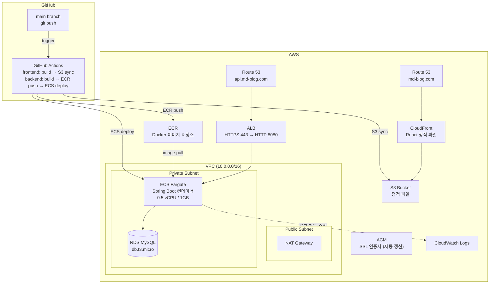
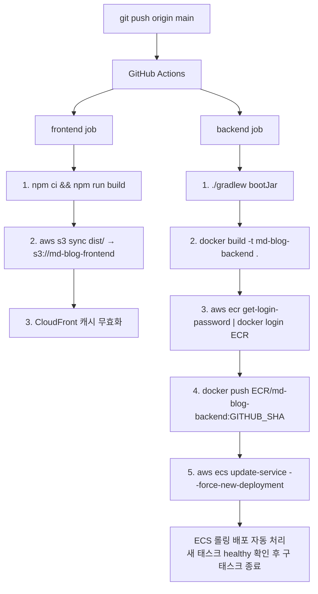

# AWS 인프라 설계

## 전체 구성도



---

## CI/CD 파이프라인 흐름



---

## 컴포넌트별 선택 이유

| 컴포넌트      | 선택            | 이유                                       |
| ------------- | --------------- | ------------------------------------------ |
| 컨테이너 실행 | ECS Fargate     | EC2 관리 불필요, 소규모에 적합             |
| 프론트엔드    | S3 + CloudFront | 정적 파일 CDN, 가장 저렴                   |
| DB            | RDS MySQL       | 현재 MySQL 사용 중, 관리형으로 백업 자동화 |
| 로드밸런서    | ALB             | ECS와 네이티브 연동, 헬스체크 내장         |
| 로그          | CloudWatch Logs | ECS → CloudWatch 자동 수집, 별도 설정 최소 |

---

## 보안 그룹 규칙

```
ALB SG       : 443 inbound from 0.0.0.0/0
ECS Task SG  : 8080 inbound from ALB SG only
RDS SG       : 3306 inbound from ECS Task SG only
```

---

## 월 예상 비용 (최소 구성)

| 항목            | 스펙                         | 예상 비용   |
| --------------- | ---------------------------- | ----------- |
| ECS Fargate     | 0.5 vCPU / 1GB, 상시 1태스크 | ~$15        |
| RDS MySQL       | db.t3.micro, 20GB            | ~$15        |
| ALB             | 기본                         | ~$18        |
| CloudFront + S3 | 소규모 트래픽                | ~$1         |
| NAT Gateway     | 1개                          | ~$33        |
| **합계**        |                              | **~$82/월** |

> NAT Gateway가 가장 비쌉니다. 초기 개발 단계라면 ECS 태스크를 Public Subnet에 두고 NAT Gateway를 제거하면 **~$49/월**로 줄일 수 있습니다.
